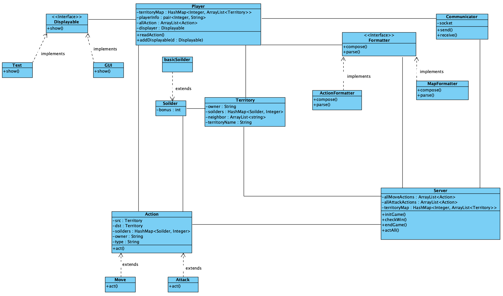

# RISC Group9

* For evolutin 1, check https://gitlab.oit.duke.edu/yy258/ece651-spr20-g9/-/commit/140c54412f46bd9fba3d752a6772d029b0de74f9
* For evolution 2, check 

## Steps
* **Please change the server address in the constructor of `Player/PlayerHelper`.**
1. Go to the root of multiproject, then `gradle run-server`. Wait until it prints "Now connect players".
2. `gradle run-player`. The first player will be asked to input the number of all players. Then just follow the printed instructions.

## Evolution 2 Prototype
* [Prototype](https://docs.google.com/presentation/d/17phhiZTou1P2t7HeLXoz7h1uZBJSJE39bzGNc9Juzk8/edit?usp=sharing)

## UX Principles
We use MVC design pattern in this evolution and follow the following UX principles:
1. Similarity: We group all the territories together with black border, so the player can easily understand they are similar. Also, the player can see three buttons “Upgrade”, “Move” and “Attack” with the same color. They are similar and represent all the actions a player can choose.
2. Proximity: We place all the actions at the bottom of the screen because they are more related. Then we show the territory detail on the right of the screen because it’s not related with the actions.
3. Common Region: In the upgrade page, we put all the upgrades in a common region (tableView).
4. Focal Point: We choose a different color for the “Done” action because it’s different from the other three and we want the player to easily notice that. Also, in the upgrade page, when the player choose an invalid territory, there will be a pop-up window with red text to capture the player’s attention. 

## Code Review
* Most of our code reviews can be found in ["comments" tab in activity](https://gitlab.oit.duke.edu/yy258/ece651-spr20-g9/activity) / [merge requests](https://gitlab.oit.duke.edu/yy258/ece651-spr20-g9/-/merge_requests?scope=all&utf8=%E2%9C%93&state=merged). 

## Sprint History
#### Sprint 1 (by Mar 13)
##### Done:
* Finished the initialization function, generating maps according to the number of all players (2-5) _defined by the server_ (changed in Sprint 2).
* Set up the socket to communicate between server and player.
* Server uses  `PlayerHandler` (extends `Thread`)  to handle and connect every player.
* Server sends `id`, `playerNum` and the `territoryMap` JSON Object (as String) to the player.
* Player can parse and print the received `territoryMap`.
* Finished the function to read actions on player-side, and the serialization and deserialization of the `Action` class.
* Finished the function to change the `territoryMap` based on the actions. Add one unit to every territory after every round. 

##### Todo:
* Finish the function to check the validity of `Action`.
* Improve the main functions of player and server, using the already implemented functions.

#### Sprint 2 (by Mar 21)
##### Done:
* According to feedback by TA: now the first player inputs the number of all players
* Finished player and server side, so that they can operate on one consistent communication process.
* Finished CI/CD set-up (“Test” failed before).
* Almost finished `checkAction` and `doAction` on the server-side. 

##### Todo:
* Continue working on the situation when we need to revoke the previous actions after finding an invalid one.

## Initial UML Review
* It was a general design of the whole project. As for some implementation details, we cannot consider throughly in the initial UML. 
* We started by thinking about what classes we need to realize the functionality. Then, we improved it by adding design principles and interfaces. However, we cannot determine what parameters to use for each function, thereby leaving some design unfeasible when implemented later.
* It has some over-sized classes, which will contribute to embarrassingly paralleled problem when we assign the tasks to team members.

## Final UML

